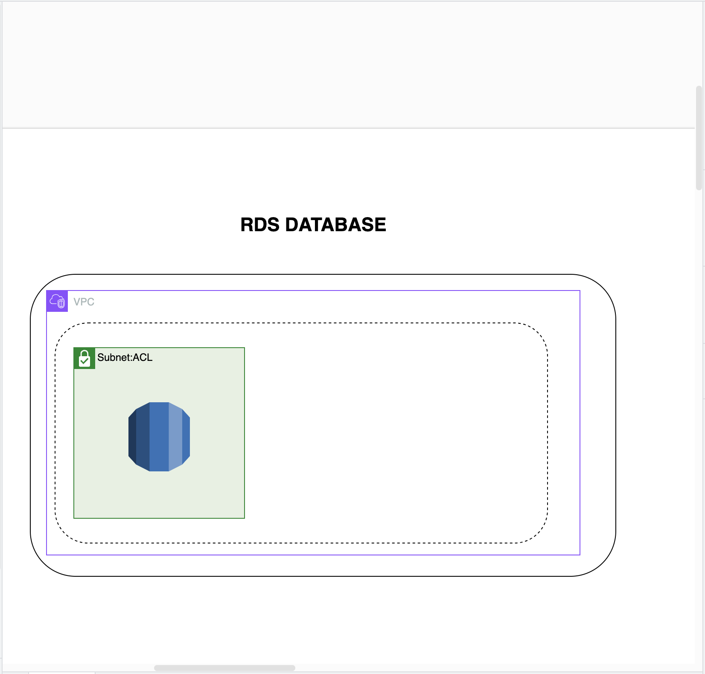

# Intro

This are a bunch of cloudformation projects that I have been working on. I have been using these projects to learn more about cloudformation and how to use it to deploy resources in AWS. I have also been using these projects to learn more about the different services that AWS offers.

## System Design



## Projects

- [VPC]
- [EC2]
- [RDS]
- [S3]
- [IAM]
- [Route53]
- [Bastian]

Among others.

## How to use

To use these projects you will need to have the AWS CLI installed on your machine. You will also need to have an AWS account and have your credentials configured on your machine. You will also need to have the AWS CLI configured with the region that you want to deploy your resources in.

To deploy a project you will need to navigate to the project folder and run the following command:

```bash

aws cloudformation create-stack --stack-name <stack-name> --template-body file://<template-file> --parameters file://<parameters-file> --capabilities CAPABILITY_IAM

```

This will create a stack with the name that you specify and deploy the resources that are defined in the template file. You can also specify parameters that the template file requires.
